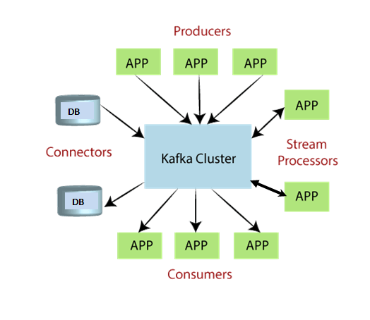
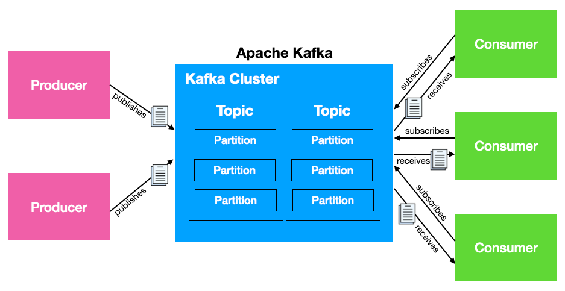

# APACHE KAFKA 

Apache Kafka is an open-source **stream-processing** software platform that is used to handle real-time data storage. It works as a broker between two parties, i.e., a sender and a receiver. It can handle about trillions of data events in a day. 

It was originally developed by **LinkedIn**, and later it was donated to the **Apache Software Foundation**.

 
 i)**Stream-processing**:- It is a way of processing data across multiple connected systems at the same time. 

It allows different applications to handle data in parallel, so one record can be processed without waiting for the previous one to finish.

 Kafka makes it easier to manage and run this parallel processing efficiently.

**Kafka Architecture Overview**

## How it Works:

* Producers are like cars entering the highway, each carrying important information.

* The Kafka Cluster is the highway itself, with multiple lanes for smooth and fast traffic flow.
*  Topics are like different lanes on the highway, each carrying traffic to a specific destination.
*  Consumers are like drivers exiting the highway at their chosen destinations to use the information.
*  Connectors are like ramps connecting the highway to other roads, allowing cars to enter or exit from different places.
* Stream Processors are like service stations along the highway, where cars can quickly get refueled or have minor repairs before continuing their journey.

**Kafka is a super-efficient highway for data, ensuring it reaches its destination quickly and safely.**

## Why Kafka?
 * Apache Kafka can handle millions of message per second, which
traditional databases like SQL cannot manage effectively. That’s why
kafka is used for real time data streaming and large scale data
processing.

* Apache kafka acts as a bridge between the source system(Producer)
and the target system(consumer). The Producer sends Data to kafka,
which organizes and manage it , allowing the consumer to retrieve
data efficiently.

* Apache kafka deliver extremely high performance with low latency of
less than 10ms, making it a highly efficient and reliable software for
real-time stream processing.

## Benefits of Kafka:

* **High Throughput**: Kafka can handle massive volumes of data with high throughput.

* **Scalability**: Kafka clusters can easily scale horizontally by adding more brokers.

* **Fault Tolerance**: Data replication ensures data durability and availability even in case of broker failures.

* **Low Latency**: Messages are delivered to consumers with low latency.

* **Flexibility**: Kafka can be used for various use cases, including real-time data pipelines, stream processing, and event sourcing.

